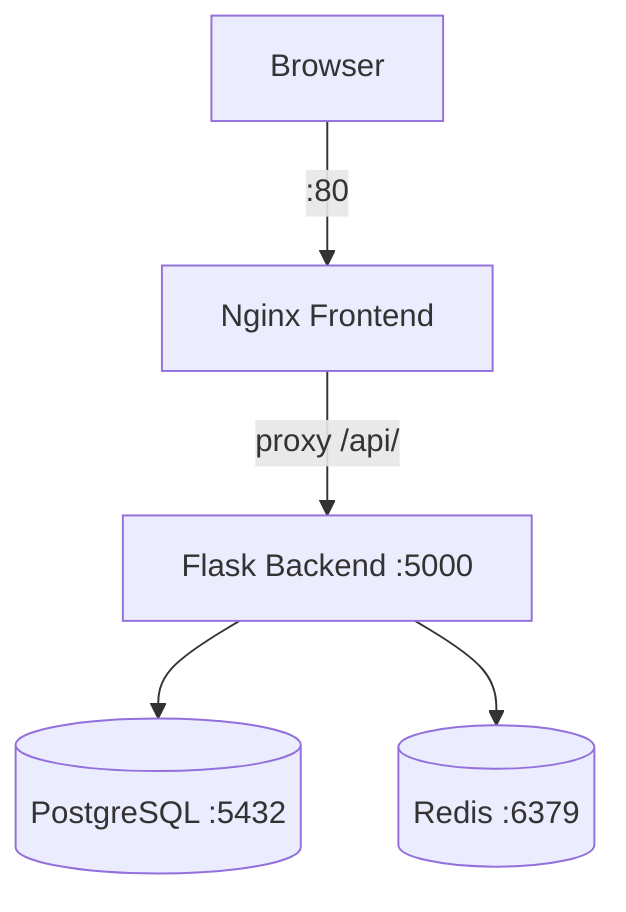

# Docker Lab — Task Manager

Полноценное веб-приложение для управления задачами (to-do list), контейнеризированное с помощью Docker Compose.
Стек: **Nginx** (фронтенд), **Flask** (бэкенд API), **PostgreSQL** (база данных), **Redis** (кеш).

---

## Архитектура

```
Пользователь (браузер)
        │
        ▼
  ┌──────────────┐
  │   Frontend   │  :80 (единственный открытый порт)
  │  nginx:1.27  │
  └──────┬───────┘
         │ proxy_pass /api/
         ▼
  ┌──────────────┐
  │   Backend    │  :5000 (внутри сети)
  │ Flask/gunicorn│
  └──────┬───────┘
         │               │
         ▼               ▼
  ┌──────────────┐  ┌──────────┐
  │  PostgreSQL  │  │  Redis   │  (оба — внутри сети, порты не проброшены)
  │   :5432      │  │  :6379   │
  └──────────────┘  └──────────┘
```



---

## Быстрый старт

### Требования
- Docker >= 24
- Docker Compose >= 2.x

### Запуск

```bash
git clone https://github.com/D4NDy7/docker-lab.git
cd docker-lab
cp .env.example .env
docker compose up -d --build
```

Откройте http://localhost в браузере.

---

## Переменные окружения

Файл `.env` (не попадает в Git, создаётся из `.env.example`):

| Переменная          | Описание                     | Пример      |
|---------------------|------------------------------|-------------|
| `POSTGRES_DB`       | Имя базы данных              | `taskdb`    |
| `POSTGRES_USER`     | Пользователь PostgreSQL      | `appuser`   |
| `POSTGRES_PASSWORD` | Пароль PostgreSQL            | `changeme`  |

Backend дополнительно получает через `environment:` в compose:

| Переменная    | Значение   | Описание               |
|---------------|------------|------------------------|
| `DB_HOST`     | `postgres` | Имя сервиса PostgreSQL |
| `REDIS_HOST`  | `redis`    | Имя сервиса Redis      |
| `REDIS_PORT`  | `6379`     | Порт Redis             |

---

## API эндпоинты

| Метод    | Путь              | Описание                   |
|----------|-------------------|----------------------------|
| `GET`    | `/api/health`     | Проверка состояния сервиса |
| `GET`    | `/api/tasks`      | Список всех задач          |
| `POST`   | `/api/tasks`      | Создать задачу             |
| `PATCH`  | `/api/tasks/<id>` | Переключить done/undone    |
| `DELETE` | `/api/tasks/<id>` | Удалить задачу             |

---

## Полезные команды

```bash
# Запуск (с пересборкой образов)
docker compose up -d --build

# Остановка (данные сохраняются)
docker compose down

# Остановка + удаление томов (данные УДАЛЯЮТСЯ)
docker compose down -v

# Статус сервисов
docker compose ps

# Логи сервиса
docker compose logs -f backend

# Войти внутрь контейнера
docker compose exec backend sh
docker compose exec postgres psql -U appuser -d taskdb
docker compose exec redis redis-cli

# Просмотр сетей и томов
docker network ls
docker volume ls

# Проверка API
curl http://localhost/api/health
curl -X POST http://localhost/api/tasks \
  -H "Content-Type: application/json" \
  -d '{"title": "Моя первая задача"}'
curl http://localhost/api/tasks
```

---

## Персистентность данных и `docker compose down -v`

Данные PostgreSQL хранятся в именованном томе `pgdata`:

- **`docker compose down`** — том сохраняется, данные на месте после перезапуска.
- **`docker compose down -v`** — удаляет том `pgdata`, все данные **безвозвратно удаляются**.

### Результаты теста

1. Запущен стек, добавлены задачи через UI и curl
2. `docker compose down` → `docker compose up -d` — задачи сохранились
3. `docker compose down -v` → `docker compose up -d` — БД пустая

---

## Бонус: Redis-кеш

Список задач кешируется в Redis с TTL 30 секунд. Кеш инвалидируется при любом изменении (POST, PATCH, DELETE). Если Redis недоступен — бэкенд работает без кеша. Статус Redis виден в `/api/health`.
